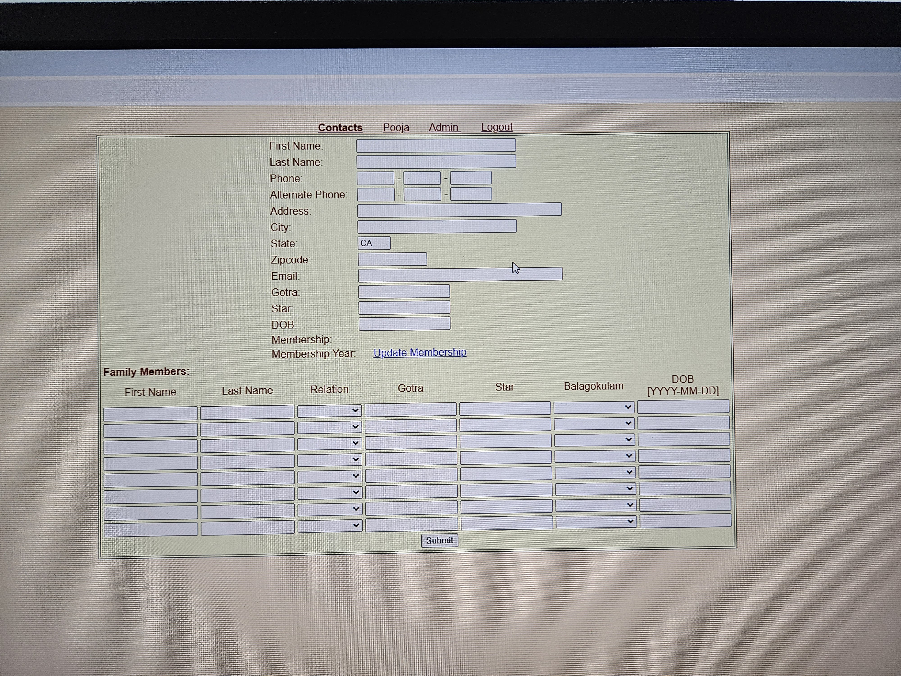
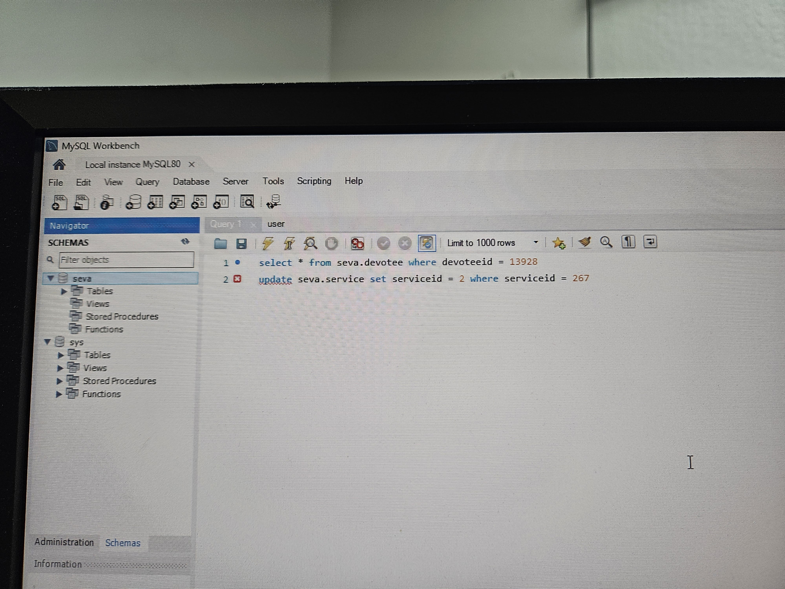
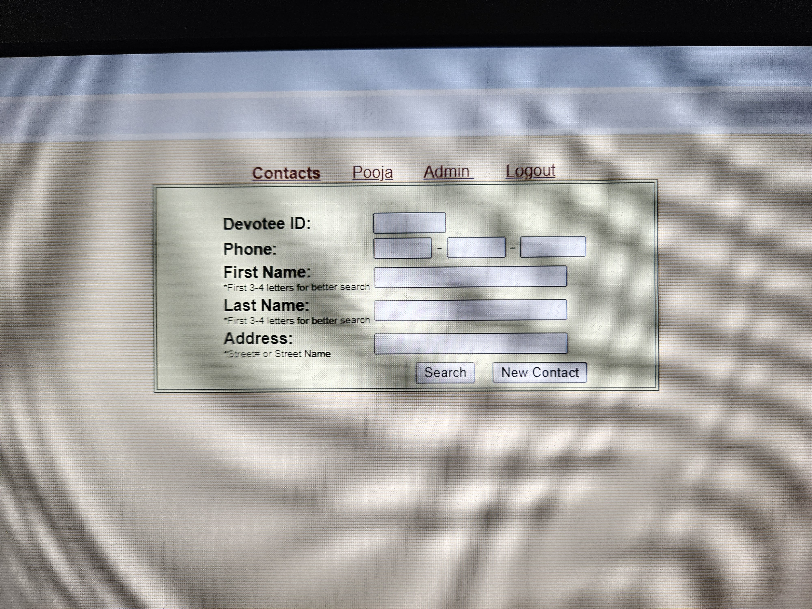
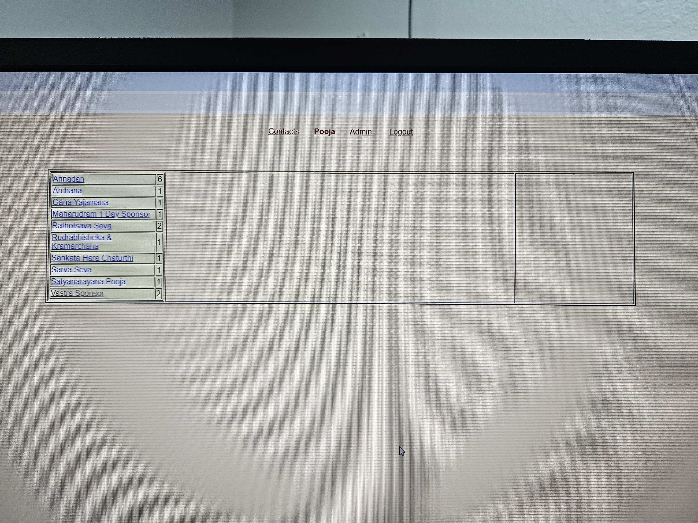
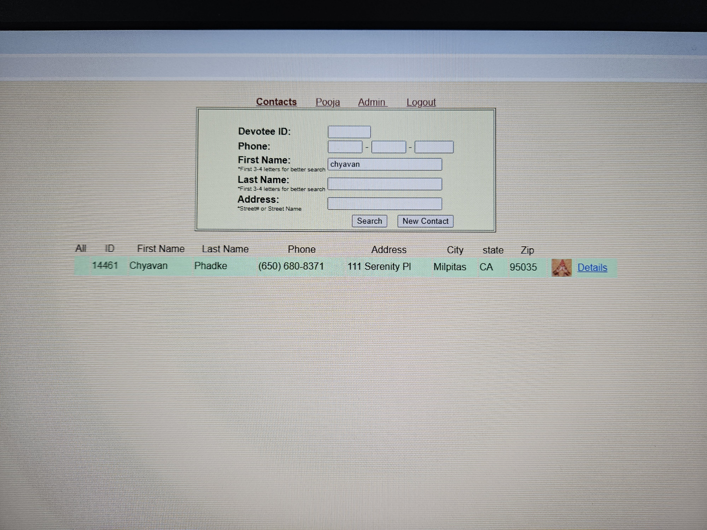
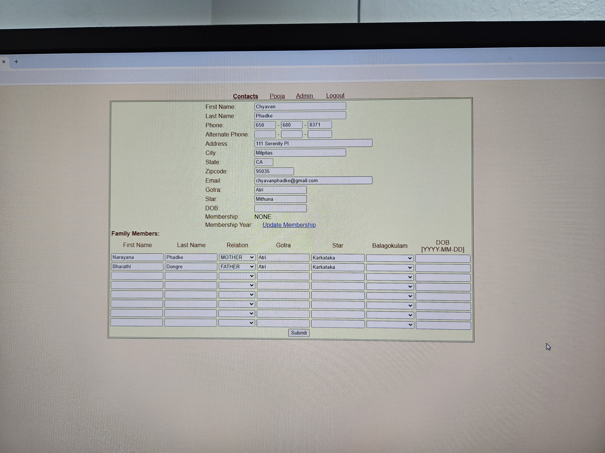
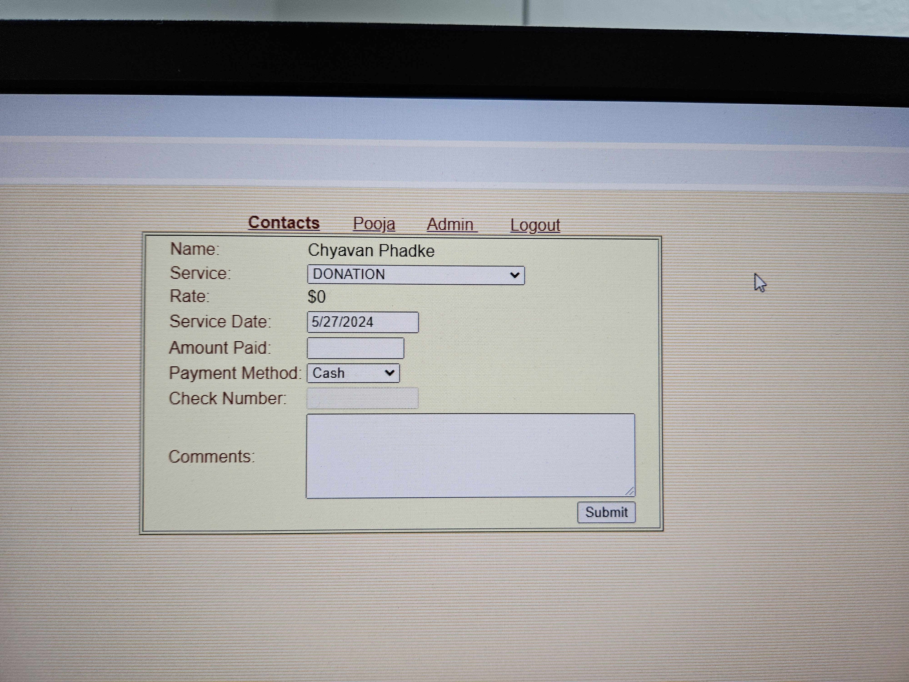
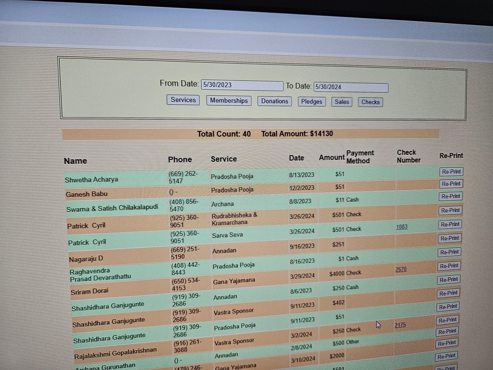
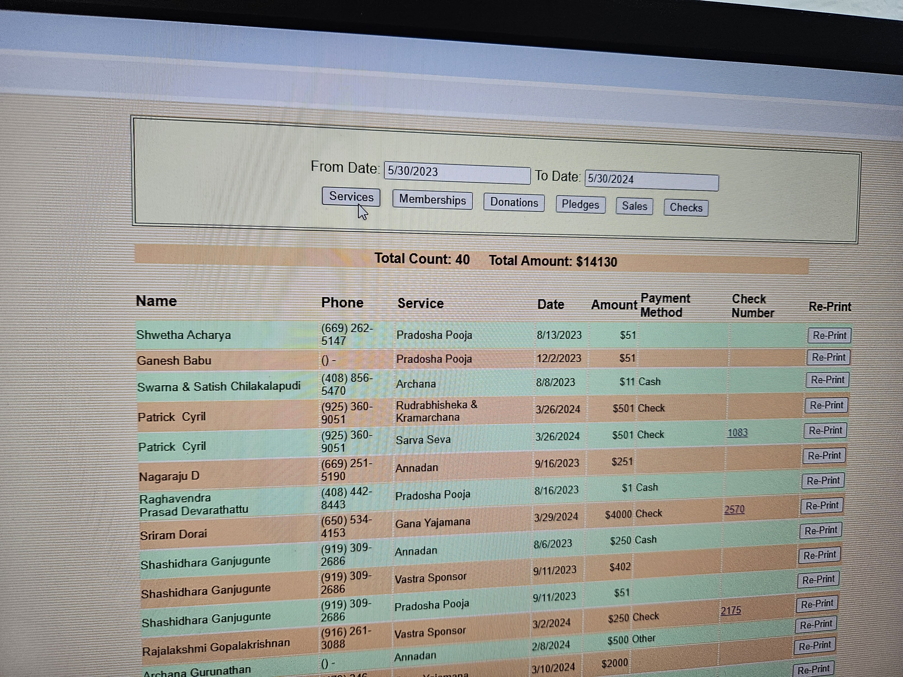
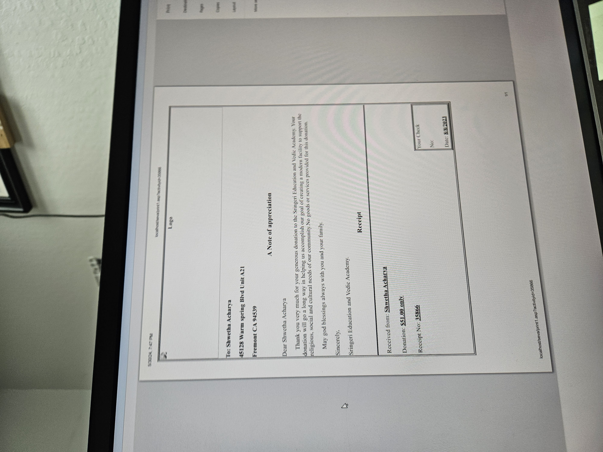

## Design Plan

Here are the architectural plans:

  
  
  
  
  
  
  
  
  
  
  
  
  

## Installation:

# Frontend:
npm install

npm install antd @ant-design/icons

npm install react-router-dom

npm install antd axios react-router-dom

npm install jwt-decode

npm start

# Backend:
npm install

npm install express body-parser sqlite3

npm install cors

npm install express body-parser bcrypt jsonwebtoken mongoose cors

node server.js
